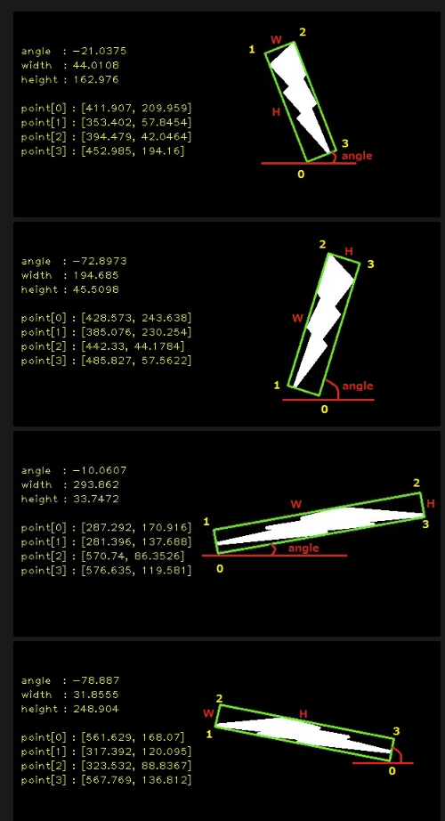

# prerequisite

LSD implementation has been removed from OpenCV version 3.4.6 to 3.4.15 and version 4.1.0 to 4.5.3 due original code license conflict and restored again after Computation of a NFA code published under the MIT license. So specific OpenCV version required.

- OpenCV >= 4.5.4 or < 3.4.6
- Eigen

# quick demo

modify image path in src/demo.cpp

```
mkdir build
cd build
cmake ..
make
./demo
```
output.png will be saved under build/

if want to see animation with all images under a folder, modify path in src/visualization.cpp.
```
./visualization
```

# some puzzling points in OpenCV

## rotatedRectangle

the sequence of points and angle of rotated rectangle

